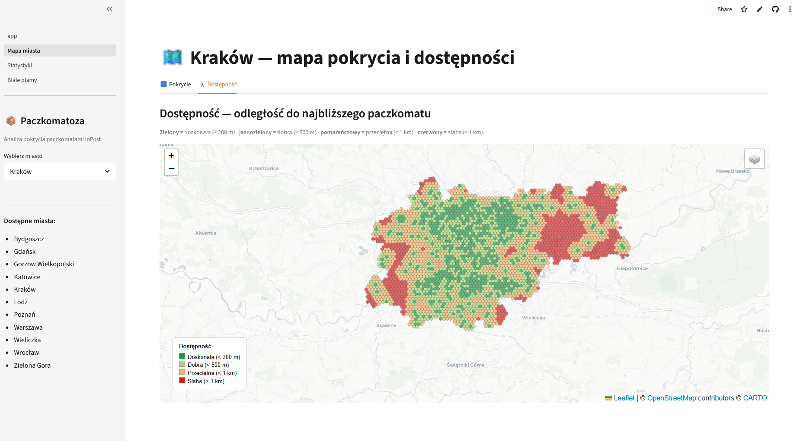
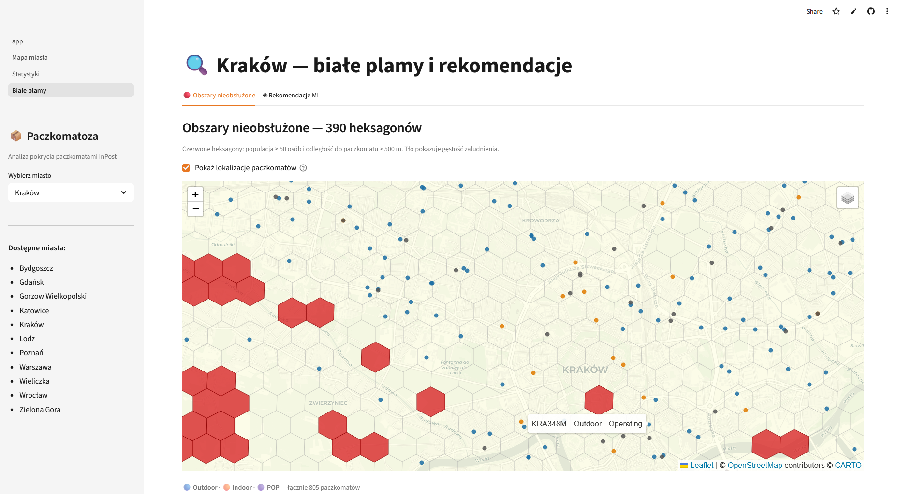
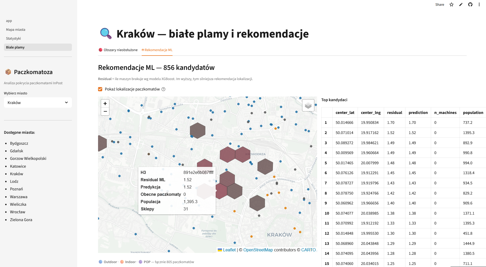

# Paczkomatoza — InPost Parcel Locker Coverage Analysis

## Author

- **Name:** Gabriel Filipowicz
- **Email:** g13filip@gmail.com

## Overview

Paczkomatoza is an interactive geospatial analysis platform that maps InPost parcel locker coverage across Polish cities using H3 hexagonal grids, population census data, and OpenStreetMap POI data. It identifies underserved residential areas and uses an XGBoost model trained on 5 cities to recommend optimal locations for new parcel lockers.

## Demo & Description

🔗 **Live app:** [paczkomatoza.streamlit.app](https://inpost-geoanalysis-vwbzj5jw6eqnufrcipsxei.streamlit.app)

### What it does

The app lets you explore parcel locker coverage for 11 Polish cities across three views:

- **Coverage map** — H3 res-9 hexagons (~174 m edge) coloured by machine density
- **Accessibility map** — distance from every hexagon centroid to the nearest paczkomat, computed with a BallTree haversine index
- **White spots & ML recommendations** — hexagons where residents live far from any machine, ranked by a residual-scoring XGBoost model

### Pipeline (local, 6 steps)

When running locally with `PIPELINE_ENABLED=1`, you can process any Polish city through the full pipeline:

| Step | What happens |
|---|---|
| 1 · Fetch API | Async pagination of InPost REST API with retry  |
| 2 · Boundary + H3 grid | OSMnx administrative boundary of the city at resolution 8 & 9 |
| 3 · Machine metrics | BallTree distances, k-ring neighbourhood counts of InPost points, weighted scores |
| 4 · Population | GEOSTAT 2021 census 1 km² grid → areal weighting onto hexagons, calculation of metrics including population |
| 5 · POI (OpenStreetMap) | 9 POI categories via Overpass API + pivot to per-hex feature columns |
| 6 · ML recommendations | Residual scoring with saved XGBoost model|

### Key technical choices

- **H3 over traditional spatial joins** — O(1) point-to-cell assignment instead of O(n²) polygon intersection; native k-ring neighbourhood aggregation without repeated spatial joins
- **Areal weighting** done in EPSG:3035 so surface ratios are accurate
- **Cross-city ML validation** — leave-one-city-out splits prevent the model from memorising local status quo; features are leakage-free (no distance-to-machine columns)
- **Two-tier deployment** — cloud serves pre-computed parquets read-only; heavy pipeline dependencies (osmnx, xgboost, geopandas) are only installed locally

### Screenshots

| Coverage map | 
|---|
|  | 
| White Spots |
|---|
| | 
| ML Recommendations |
|---|
| |

## Technologies

| Layer | Libraries |
|---|---|
| Web app | `streamlit`, `streamlit-folium`, `folium` |
| Geospatial | `h3`, `shapely`, `geopandas`, `osmnx` |
| Data | `pandas`, `pyarrow` |
| ML | `xgboost`, `scikit-learn` (BallTree), `optuna` |
| API client | `httpx` (async), `pydantic` v2 |
| Population | Eurostat GEOSTAT 2021 via `geopandas` |

## How to run

### Prerequisites

- Python 3.11+
- `libgeos` system library (for Shapely):
  - Debian/Ubuntu: `sudo apt install libgeos-dev`
  - macOS: `brew install geos`
  - Windows: included with the Shapely wheel

### Build & run — view only (no pipeline)

```bash
git clone git@github.com:g13filip/InPost-GeoAnalysis.git
cd inpost-geoanalysis

pip install -e .
pip install streamlit streamlit-folium folium shapely h3 pandas pyarrow

streamlit run streamlit_app/app.py
```

Pre-computed data for 11 cities is included in the repo. The app starts in read-only mode (`PIPELINE_ENABLED=0` by default on cloud).

### Build & run — full pipeline (add new cities)

```bash
# Install all dependencies including pipeline tools
pip install -e .
pip install streamlit streamlit-folium folium shapely h3 pandas pyarrow \
            geopandas osmnx httpx pydantic xgboost scikit-learn optuna

# Copy and fill in secrets
cp .streamlit/secrets.toml.example .streamlit/secrets.toml
# Edit secrets.toml: set INPOST_API_BASE and PIPELINE_ENABLED=1

streamlit run streamlit_app/app.py
# Then use "Dodaj nowe miasto" in the sidebar
```

### Secrets

| Variable | Description |
|---|---|
| `INPOST_API_BASE` | InPost API endpoint URL |
| `PIPELINE_ENABLED` | `"1"` for full pipeline, `"0"` for view-only (cloud) |

## What I would do with more time

1. **Dasymetric population mapping** — replace 1 km² areal weighting with building-footprint-weighted disaggregation (OSM `building=*`) for much more accurate per-hex population
2. **Retrain ML model on more cities** — currently trained on 5 cities; adding 10+ would reduce cross-city generalisation error (R² ≈ 0.37 → target 0.55+)
3. **PyDeck instead of Folium** — Folium serialises GeoJSON per hexagon which is slow at 5000+ hexes; PyDeck's `H3HexagonLayer` renders GPU-accelerated WebGL at any scale
4. **Temporal analysis** — the pipeline snapshots API state daily; with 6+ months of snapshots, we could model *where InPost is expanding* and predict next quarters

## AI usage

Claude was used throughout this project as a development partner. Specifically:

- **Architecture design** — initial module structure (`ingest/`, `geo/`, `transform/`, `analysis/`, `viz/`, `io/`) and the two-tier deployment strategy were discussed and designed iteratively
- **Code review** — each pipeline step was reviewed after implementation, incorrect areal weighting projections and data leakage in ML features
- **Streamlit UI** — the multi-page app, progress bar, city selector, and pipeline runner UI were scaffolded with Claude and then adapted

All generated code was reviewed, tested locally against real InPost API responses and actual parquet files, and often modified before being committed. The core analytical logic (areal weighting formula, BallTree haversine, H3 spatial indexing, XGBoost cross-city validation) was verified against the original Jupyter notebooks.

## Anything else?

The XGBoost model deliberately excludes all features derived from machine locations (distances, neighbourhood counts) to avoid data leakage — the model must predict demand from population and POI alone, making residuals genuinely meaningful as "where the infrastructure hasn't caught up with demand."
